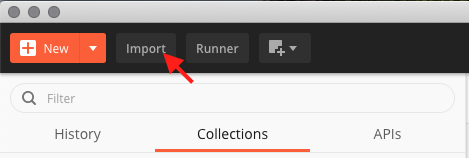
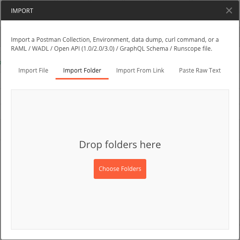

# Flask Rest API Boilerplate

A boilerplate for Python Flask Rest APIs.

## Application initialization

To initialize the application, run:

```
./app.sh -i
```

This will create your `local.cfg` and creates then conda environment.

## Generate application secrets

To generate values for the App and JWT secret keys in your `local.cfg`:

```
./app.sh -s
```

## Conda environment

To initialize the conda environment, run the following in the root project directory:

```
conda env create -f environment.yml --prefix ./api_env
```

This runs as part of the application initialization, so you should not need to run this manually.

However, note the `--prefix ./api_env`. This creates the environment in the project directory in a folder called `api_env`.

This will result in a long prefix in your command prompt. To address this, if you haven't already, run the following:

```
conda config --set env_prompt '({name})'
```

To activate the environment:

```
conda activate ./api_env
```

Deactivate:

```
conda deactivate
```

If you add any new packages via conda or pip, make sure to update the `environment.yml`:

```
./app.sh -e
```

To ensure you have all the dependencies defined in the `environment.yml`, run:

```
./app.sh -u
```

To run the test suite defined in the ```tests/``` folder, run:

```
./app.sh -t
```

## Running the Application

The application and available commands are run via the `manage.py` file located in the root of the project.

To see what commands are available:

```
python manage.py
```

To run the application:

```
python manage.py run
```

## Application Configuration

Application configuration is managed via `.cfg` files located in the `app.main.config` package.

Defaults are stored in the `defaults.cfg` file, while local overrides can be done via a `local.cfg` file. Don't include one at all if you simply want to use the defaults.

Configuration files are broken up into sections, each of which contains keys with values. Here's an example:

```.ini
[database]
host = 127.0.0.1
port = 27017
name = db_name
user = db_user
passw = db_pass
``` 

In this example, `[database]` is the section, while the lines below are keys and their values available as part of the database section. It's important to note that all values are automatically considered to be a string. So when processing them to be used, make sure to convert them to the proper type as necessary.

See python documentation on [ConfigParser](https://docs.python.org/3/library/configparser.html) for more details. **Note:** `.ini` files can be used in place of `.cfg` files. They are interchangeable.

If additional configuration needs to be added, either update existing config classes in the config package's `__init__.py`, or add a new class.

## Development

Development of an application based off of the flask_rest_boilerplate should fall into one of the following categories:

    - CLI Commands
    - Controllers (API Routes)
    - Database models
    - Services
    - Utilities
    
When adding new code, it is advisable to build within one of these sections, though it isn't required and this can be extended as desired. 

### CLI Commands

CLI commands are any tasks/functions that are intended to be run via the command line. For example, a command line tool for creating new clients.

They are managed via the `app.main.commands` package.

For more information on how commands are created and managed, check out the flask-script documentation on [creating and running commands](https://flask-script.readthedocs.io/en/latest/#creating-and-running-commands).

Registering new commands is done in the `app.main` packages `__init__.py` within the `create_manager` function.

### Controllers (API Routes)

Controllers are what manage the REST API routes, or what can sometimes be referred to as resources.

Every resource conforms to the CRUD methodology (Create, Read, Update, Delete) and therefore support the following functions:

    - get (read)
    - post (create)
    - put (update)
    - delete (delete)
    
To facilitate the development of proper REST conventions, we are using [flask-restx](https://flask-restx.readthedocs.io/en/latest/) which is a wrapper around [flask-restful](https://flask-restful.readthedocs.io/en/latest/).

The purpose of [flask-restx](https://flask-restx.readthedocs.io/en/latest/) is to provide additional decorators that are used to automatically generate [Swagger](https://swagger.io/) documentation which will be available via the root URL of the application (locally, this will be http://127.0.0.1:5000).

Each `app.main.controller` package contains multiple resources that will make up an API namespace.

API namespaces are defined via DTOs (Data Transfer Objects) within the `app.main.utils.dto` package, accessible via the controller and registered in the `app` package in the `__init__.py` file.

Models that define the different data maintained by an individual namespace are also defined via the DTOs.

## Databases

By default, this boilerplate supports a connection to a single database, although developers can add multiple database connections if they choose to do so. [SQLAlchemy](https://www.sqlalchemy.org/) supports multiple database connections with its [binds](https://flask-sqlalchemy.palletsprojects.com/en/2.x/binds/) feature, while mongoengine supports multiple connections through aliasing (example [here](https://blog.sneawo.com/blog/2017/04/11/how-to-use-multiple-databases-with-flask-mongoengine/)).

This boilerplate offers support for both SQL and NoSQL databases (currently [mongodb](https://www.mongodb.com/) is the only supported NoSQL database). The developer can toggle between sql and nosql by changing the ```type``` key under the ```[database]``` section to either ```sql``` or ```mongo```.

### Database Models (SQL)

This boilerplate supports the multiple flavours of SQL databases that are supported by SQLAlchemy such as PostgreSQL, MySQL, and SQLite. SQLAlchemy provides an object-relational mapper (ORM) that allows developers to map database entities to python classes. 

Among other advantages, the ORM allows the developer to decouple the object model and database schema, which means the developer can be agnostic to the SQL database implementation that will be used in various stages of development. For example, the developer's workflow will not be affected if a SQLite datbase is used during development and a PostgreSQL database is used in production.

This boilerplate makes use of [flask-sqlalchemy](https://flask-sqlalchemy.palletsprojects.com/en/2.x/), which is a Flask extension that adds support for SQLAlchemy.

The following values in ```main/config/defaults.cfg``` need to be specified:

```ini
[database]
type = sql

dialect = sqlite

host = 127.0.0.1

port = 27017

name = flask_api

user =

pass =
```
>TODO: add a manual override field where the user can include their own connection URL if their connection URL does not match one generated by ```assemble_sqlalchemy_url```.

The function ```assemble_sqlalchemy_url``` uses these values to create a connection url that is assigned to the ```SQLALCHEMY_DATABASE_URI``` property in the main Flask configuration.

To add a model, import the ```db``` object from the ```db``` module in the root of the ```/main``` folder, then create the model class extending ```db.Model```. For reference, a simple example of an ```Employee``` object model is included in the ```/models``` folder of this boilerplate.

### Database Models (NoSQL)

This boilerplate supports the use of [MongoDB](https://www.mongodb.com/) via [mongoengine](http://mongoengine.org/). ```mongoengine``` is a Document-Object Mapper (like an Object-Relational Mapper for a SQL databases) for working with MongoDB in Python.

New document models are added in the `app.main.models` package.

The benefit of using a Document-Object Mapper is it provides an abstraction layer over top of your NoSQL database of choice with built in save/delete functionality as well as persistent object store with query and filtering capabilities.

For example, if you have an instance of the `Client` document model, you automatically have access to all documents stored in the `client` container. They can be retrieved by calling:

```python
from app.main.models.client import Client
all_clients = Client.objects().all()
```

Alternatively, you can access a single client by client_id:

```python
from bson.objectid import ObjectId
from app.main.models.client import Client
client_id = ObjectId("5e6fc3128611120971f673f2")
client = Client.objects(id=client_id).first()
```

Refer to the [mongoengine documentation](https://mongoengine-odm.readthedocs.io/) for any additional details.

### Services

Services are static methods, or a collection of static methods via a class, that are intended to implement application functionality. They are to live within the `app.main.services` package.

More often they are used to access and process data to and from the database, such as the `client_service`, but sometimes can also be used for generic functionality, such as retrieving the currently authenticated client.

### Utilities

The `app.main.utilities` packages is intended to be used for any utility functionality such as Date utility functions (if it weren't already baked into python).

Initially, it includes the definition of data transfer objects (DTOs) that define the namespaces and models that make up the Rest API. 

## Authentication

API authentication is imperative to help ensure the security of client/user data in any application. 

To this end, we are using the [flask_jwt_extended](https://flask-jwt-extended.readthedocs.io/en/stable/) package to automatically manage endpoint authentication.

To authenticate, a user will need to retrieve an `access_token` via an `/authorize` endpoint. This endpoint, or any like it, will request user/client credentials and return an `access_token` on successful authentication.

The user will then provide the `access_token` via the `Authorization` header, prefixed the by the key term `Bearer`, when making any API requests that require authentication.

Endpoints are deemed to require authentication by adding the `@jwt_required` decorator to individual resource methods.

Because [JWT Tokens](https://jwt.io/) are being used for authentication, you can store any data you want to be accessibly via authenticated routes by specifying it via the `identity` argument when creating an access token during authentication.

## Tests
Tests are designed to be run from the root of this directory. Run ```./app.sh -t``` or ```./app.sh --test``` to run the test suite.

Tests are written using Python's ```unittest``` framework and initially divided into unit, integration, and system tests. The intention of each folder is as follows:

- __unit__ tests are designed to test individual components that do not have any external dependencies (e.g. testing a [pure function](https://en.wikipedia.org/wiki/Pure_function)).
- __integration__ tests are designed to test the integration between two (or few) components. For example, if one function returns a value that is used by another function, an integration test might ensure that the second function correctly recieves and handles the data from the first function.
- __system__ tests represent the highest level of test complexity, where higher level components of a system are tested. For example, using Flask's ```app_context``` and ```test_client``` to handle a fake request to a specific API endpoint would constitute a system test (for more information on the utilities Flask provides for creating testing context, see Flask's [testing documentation](https://flask.palletsprojects.com/en/1.1.x/testing/)).

While the ```tests/``` folder is initialized with the above structure, this framework is not opinionated on how tests are organized. ```unittest``` will discover tests in the ```/tests``` folder regardless of how they're structured (but see caveat below).

__Caveat:__ in order for ```unittest``` to recursively discover nested folders, they must be importable. Therefore, every nested folder that contains ```unittest``` tests should also include an ```__init__.py``` file.

Additionally, a ```BaseTest``` class is provided in the root of the ```tests/base_test.py```. Integration and system tests that require a database and/or application context to be setup (e.g. to make a fake request for testing purposes) extend ```BaseTest``` instead of ```TestCase```.

By default, ```BaseTest``` resets the application context and database contents after each test is run. This means that each test case is like a blank slate, so that CRUD operations of previous tests do not impact the current test. Additionally, during testing, a SQLite database called ```tests.db``` is created in the ```/main``` folder. The purpose of this second database is to ensure that anything that happens in a testing context does not affect the state of whatever database is currently being used by the Flask application.

To change any of the defaults described above, you can modify the appropriate method in ```BaseTest```.

## Postman Tests
In addition to ```unittest```, this boilerplate is set up with a simple postman collection. [Postman](https://www.postman.com/) is an open source application used primarily for API testing. Using postman, it is possible to write live tests for your API as you develop.

Although this boilerplate is not opinionated on the use of postman, it provides a basic environment and test suite in the ```/postman``` folder for convenience.

### Importing Postman Folder

Open the Postman application, click the "Import" button in the top right corner, and select "Import Folder".

<div style="text-align:center">
    
</div>

Select the ```postman/``` folder in this repo, and the test suite and environment will be imported automatically.

<div style="text-align:center">
    
</div>

Don't forget to export your test collection/environment if you make changes. Postman exports collections and environments in ```json``` format, so it is easy to include them in version control if you work on a project that involves API testing with multiple collaborators.